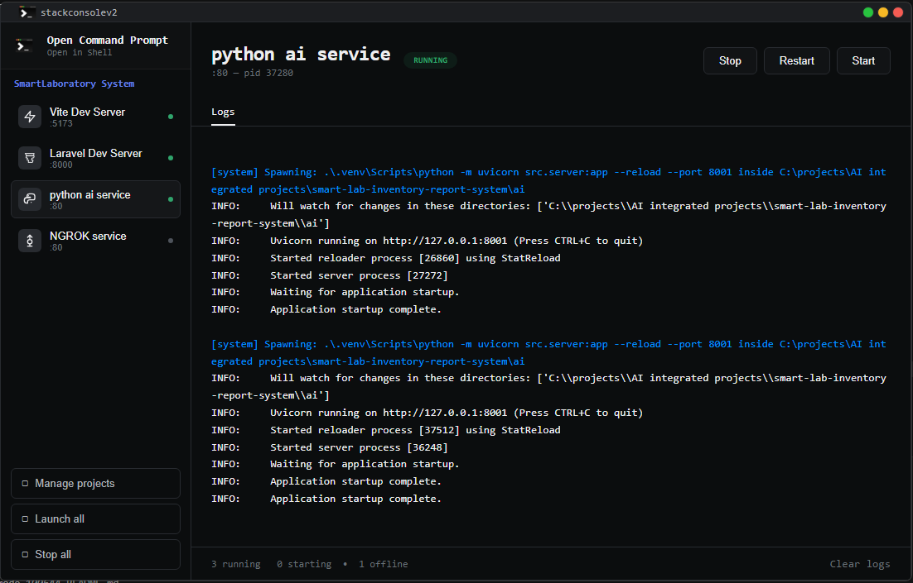

# StackConsole

**Multi-process microservice engine and interactive local service terminal dashboard.**

---

## Overview

StackConsole is a desktop dashboard for developers who need to run and monitor multiple local services simultaneously. Launch your PHP Artisan server, Vite dev server, Node.js watcher, Python scripts — all from one window. See live logs, port status, and process health at a glance.

---

## Features

- **Multi-process management** — run any number of commands side-by-side
- **Live log streaming** — Python-powered IO captures stdout/stderr in real time
- **Project workspaces** — group related commands into projects
- **Status dashboard** — green/yellow/red dots show which services are running
- **Dark theme** — high-contrast, comfortable for all-day use
- **Port tracking** — see which port each service binds to
- **In-app terminal** — run ad-hoc commands without leaving the dashboard
- **Persistent data** — projects survive app restart (stored in `%APPDATA%`)

---

## Getting Started

### Install

Download the latest installer from the [Releases page](https://github.com/tionic929/stack-console-v2/releases) and run it. Python 3.x must be on your system PATH.

### First Run

1. Open StackConsole
2. Click **+ Add Project** and give it a name
3. Click **+ Add Command** and enter a command (e.g., `php artisan serve`, `npm run dev`, `python app.py`)
4. Click **Start** on any command — logs appear immediately
5. Use the terminal prompt at the bottom for ad-hoc commands

---

## Requirements

| Requirement | Details |
|---|---|
| **OS** | Windows x64 |
| **Runtime** | Python 3.x (must be on `PATH`) |
| **Disk** | ~200 MB |

---

## Tech Stack

No frameworks. No bundlers. Just Electron, vanilla JS, and a Python helper for process I/O.

---

## Why StackConsole?

Built for developers who found themselves juggling multiple terminal windows during local development — PHP Artisan, Vite, Node watchers, Python scripts, database servers. One dashboard to launch, monitor, and stop every service your project needs.

---

## License

GNU General Public License v3.0 — see [LICENSE](LICENSE).

---

## Contributing

Contributions welcome! Open an [issue](https://github.com/tionic929/stackconsolev2/issues) or submit a [pull request](https://github.com/tionic929/stackconsolev2/pulls).